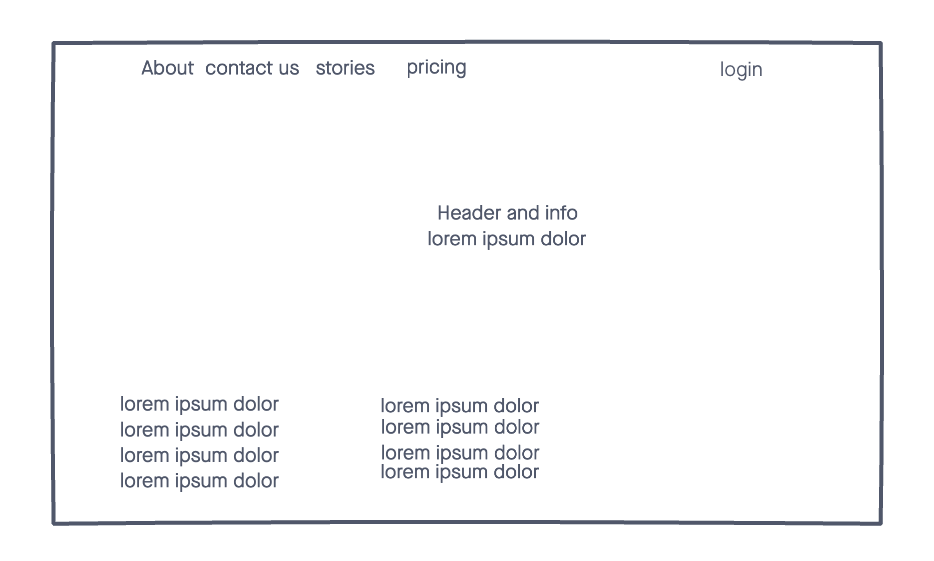

# Sei Resource Manager  🗄

ATTN: All sei-perseverance students! We have a treat for you! Need the video and markdown for Unit 2's "Intro to Node.js" or Unit 1's "Intro to the DOM" video and markdown in a hurry? Your now able to find all unit video recordings and lessons with a click of a button. 
 
You will need to login. Then click the unit your interested in, and scroll untill you find the vid and lesson you want. Enjoy!

## Technologies Used ⚙️

- CSS3
- HTML
- JS
- Ruby
- React
- Github 
- Vercel (for deployment)
- Heroku (Backend deployment)

## Screenshots 📸

## Getting started 🚴🏽‍♂️

[Click](https://sei-resource-manager.vercel.app/) here to get started and see the app online!

## Future Enhancements  🛠  
